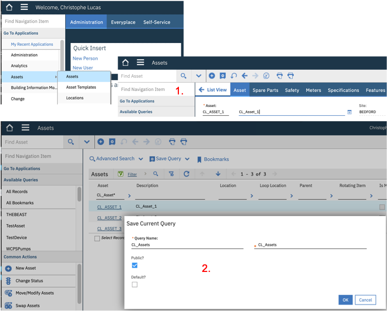

# HEALTH Lab

For full documentation visit [mkdocs.org](https://www.mkdocs.org).

## 0. Overview & Prerequisites

In this Module you will:
* bh

## 1. Create 3 Assets & 1 Query in Maximo
1. In Maximo, click the `Go To Applications - Asset` Menu. Click the + button to create an Asset, 
enter `CL_Asset_1` in both the *Asset ID* & *Description* fields. Click `Save`. 
Repeat this step for `CL_Asset_2` and `CL_Asset_3`.
2. Click the `List View` menu. In the Asset field, enter `CL_Asset*`, click enter. 
This should return the list of your 3 just-created *CL_Assets*. 
Click the `Save Query` button, enter `CL_Assets` in in both the *Query Name* & *Description*. Tick the `Public` box.
&nbsp; 

## 2. Create a Meter Group
In this section, we will create a maximo *Meter Group* containing 8 *Meters* that we will later associate to the 
*IoT readings* that we defined in the first section of the MONITOR lab.

1. In Maximo to-left `Find Navigation Item` box, enter the `Meter Groups` application.
2. Click the + button to create a Meter Group, enter `CL_Asset` in both the *Meter Group* & *Description* fields.
3. Click `New Row` and in the *Meter* field, click `Select Value`. 
In the *Select Value* window that opens, enter `Temp` in the Meter field, hit Enter, select `TEMP-C`.
4. Repeat previous step with the following *Meters*: 
`VIBRATIONH`, `PRESSURE`, `SPEED`, `ACCELERAT`, `LOAD`, `TORQUE`, `STARTS`. Click the `Save` button.

Note that, although Meters like `PRESSURE` often exist in Maximo installations out-of-the-box, 
some of the Meters appearing in step 4. might not exist in Maximo yet. In which case, do the following:
(a) Go to the `Meters` menu via `Find Navigation Item`, (b) click `Create` new Meter, enter e.g. `ACCELERAT` (the maximum name length is 9 ),
select `GAUGE` as `Meter Type`, then `Save`. That newly created *Meter* can now be added to the *Meter Group* in step 4.
&nbsp; 

## 3. Associate Meter Group to your Assets & create Meter Readings
1. In Maximo, click the `Go To Applications - Asset` Menu. In the Asset field, enter `CL_Asset*`, click enter.
This will return the list of you 3 *CL_Assets*, click `CL_Asset_1`.
