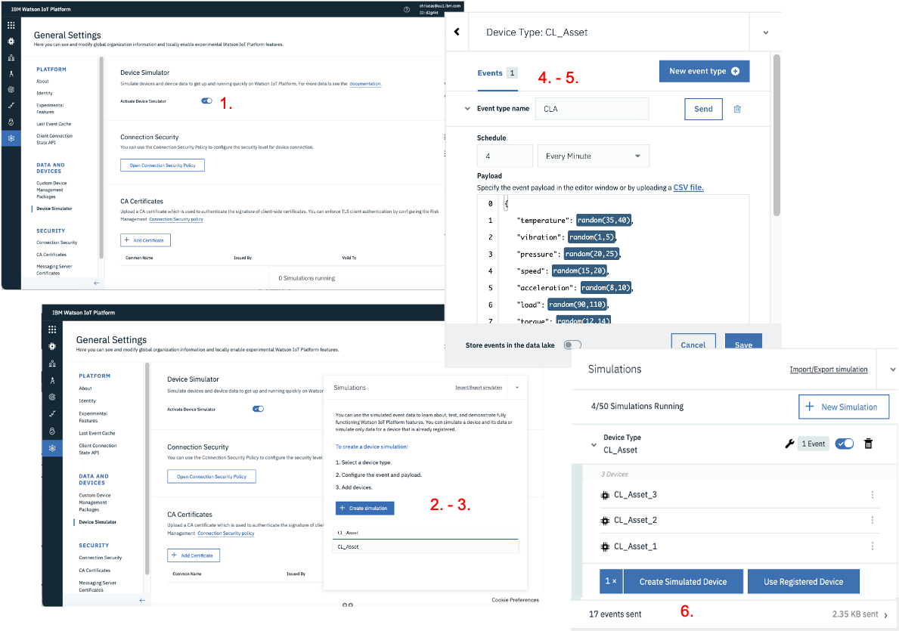

# MONITOR Lab


## 0. Overview & Prerequisites

Welcome to the IBM Maximo Asset Performance Management (APM) labs.

These labs were conceived to:

* take you through
* again

This picture summarises the main elements of APM and how they are integrated.

 &nbsp;  

## 1. Generate the data

In this Module you will:

* Create a Device Type and 3 Devices of that Type
* Generate IoT data for those 3 Devices using an IoT simulation
* Create Physical & Logical interfaces to send the IoT data to the Monitor data lake
* Visualise the IoT data in a Watson IoT Platform simple dashboard

---
*Before you begin:*  
This Exercise requires that you have completed Exercise 1 Connected Devices
---

### 1. Create Device Type & 3 Devices

Let's first create a *Device Type*. 

1. From your *Monitor* Instance *Home* page, click `Connect Devices`
2. On the opened *Connect* menu, click `Open Platform Service application` in the top-right corner. This will launch the associated *Watson IoT Platform* in a separate browser tab.
3. Go to the *Device Types* menu, and click `Add Device Type`.
4. Enter `XY_Asset` in the *Name* and *Description* fields - where `XY` are your initials. Note that for the rest of this lab, we will use `CL_Asset` (e.g. CL for Christophe Lucas). Click `Next`.
5. On the next *Metadata* page, enter `CL` in *Model* and *Manufacturer* fields, and enter `CL_Asset` in *Device Class* field. The reason why we want to enter values here is to later show how *Dimensions* can be used in *Monitor* to slide and dice the data. Click `Finish`.

The below picture shows the 5 previous steps.
&nbsp; 

Now, let's create 3 *Devices* of type *CL_Asset*.

1. Stay in the *Watson IoT Platform*, go to the *Browse* menu and click `Add Device`.
2. On the *identity* page, select your just created `CL_Asset` as *Entity Type* and enter `CL_Asset_1` in *Device ID*. Click `Next`.
3. On the *Device Information* page, accept the defaults, click `Next`.
4. On the *Security* page, accept the defaults, click `Next`.
5. On the *Security* page, accept the defaults, click `Next`.
6. Click `Back`, and repeat above steps 1 to 5 for 2 more Assets: `CL_Asset_2` and `CL_Asset_3`.
7. Finally, go to the `Browse` menu, enter `CL_Asset` in the *Search* field, and you will now see your 3 Devices.

You have now created the required `CL_Asset` *Device Type* and the 3 `CL_Asset_1`, `CL_Asset_2` and `CL_Asset_3` *Devices* that we will use throughout the labs.

The below pictures shows the 7 previous steps.
 &nbsp;  

---
### 2. Create IoT Simulation
Let's now send data to those 3 Devices !

Using the Watson IoT Platform [IoT Simulation](https://www.ibm.com/support/knowledgecenter/en/SSQP8H/iot/platform/reference/dashboard/device_sim.html) capabilities,
it is possible to simulate a device and its IoT readings - exactly as if this was a real IoT device really connected to the platform and sending real IoT readings.
We are going to use this great functionality as it allows one to literally simulate any asset (e.g. *Pump, Engine, Truck, Conveyor Belt* - you name it !), any IoT readings and do any demo.
For this Lab, we will simulate our 3 `CL_Asset_1_2_3` Devices generating the following IoT readings: `temperature`, `vibration`, `pressure`, `speed`, `acceleration`, `load`, `torque`, `starts` . You can of course change the IoT reading names and/or their values to fit your demo needs.

1. First of all, make sure that in your *Watson IoT Platform*, *Settings* menu, the `Activate Device Simulator` is ON. Once that is done, you will see a little box in bottom-right of your screen showing *0 Simulation*.
2. Click on that `0 Simulation` bottom-right box, and click `Create Simulation`.
3. In the `Select or create a device type` box, select the `CL_Asset` device type you earlier created. That will open a window as you can see kit in picture below - let's customize this.
4. In `Event type name`, enter *CLA*. in the `Schedule` field, enter `4 Every Minute`. In the `Payload`, copy-paste the following .json code. Make sure at this stage that the `Store events in the data lake` box remains unchecked ! Click `Save`.
5. Click `Use Registerd Device`, enter *CL_Asset* in the `Pick Device` box, select *CL_Asset_1*. Repeat for *CL_Asset_2* and *CL_Asset_3*.
6. You should now start seeing Events flowing in the bottom Events box.

Note that the values in the `random(35,40)` functions can be considered being the 'standard operating conditions' for the given IoT reading. 
Later on in the lab, we will change those value ranges for short periods of time (i.e. change the `temperature` ranges from `random(35,40)` to `random(46,49)`) and show how Monitor's out-of-the-box anomaly functions can automatically spot these 'anomalies' which are deviations from the 'standard operating conditions'.

```
 {
    "temperature": random(35,40),
    "vibration": random(1,5),
    "pressure": random(20,25),
    "speed": random(15,20),
    "acceleration": random(8,10),
    "load": random(90,110),
    "torque": random(12,14),
    "starts": increment(1,1)
 }  
```
The below pictures shows the 6 previous steps.
 &nbsp; 

Great, you now have your 3 `CL_Asset_1_2_3` Devices generating IoT readings 4 times every minute. 
Let's check those readings on a Dashboard.

---
### 3. Create Watson IoT Platform Dashboard

Let's create a Dashboard so we can see the simulated IoT readings for 1 of our devices: `CL_Asset_1`. 
This Dashboard will allow us to clearly visualise the anomalies earlier mentioned.

1. Still in the *Watson IoT Platform*, click on the *Boards* menu. Click `Create Board`. Name the Board `CL_Asset IoT Readings Dashobard`. Click `Next` then `Submit`. Open the Board.
2. Let's first create a small card which displays the 8 IoT Readings we simulated, getting updated every 15 seconds. Click `Add New Card`. Select `All device properties` then `CL_Asset_1`, then `Next` then `Submit`.
3. Let's now create a card which whos the flow of data. Click `Add New Card`. Click `Line Chart`, then select `CL_Asset_1`. 
4. Click `Connect data set`. In the *event* field, select `CLA` (that is the name of the IoT Simulation we created earlier),
then in the *Property* select `temperature`. Repeat this for a couple more properties, e.g. `vibration` and `pressure`. Click `Next`, select the `XL` size, click `Next` then `Submit`.
5. Drag and drop the second card next to the first one. Play with the `5 minutes` to `24 hours` views.

The below pictures summarise the previous steps and show what your Dashboard should like.
 &nbsp;

---
### 4. Create Physical & Logical Interfaces

So far, we have only generated simulated IoT data. 
What Monitor uses for all its visualisations and calculations is the data from the [data lake](https://www.ibm.com/support/knowledgecenter/SSQR84_monitor/iot/overview/architecture_mon.html).
Monitor's data lake is being populated through the use of [Physical & Logical](https://www.ibm.com/support/knowledgecenter/en/SSQP8H/iot/platform/GA_information_management/ga_im_device_twin.html) interfaces.
Let's create those interfaces and populate that data lake !

First let's create the Physical Interface.

1. Still in the *Watson IoT Platform*, go to the *Device Types* menu, search then select *CL_Asset*, then click on the *Interface* menu.
2. Click `Create Physical Interface`. Leave the default name *CL_Asset_PI*, click `Next`.
3. Click `Create event type`. Wait 15 seconds or click `Use Last Event Cache` and you will see the *CLA* (which corresponds to the IoT Simulation we earlier created) event appear. 
4. Click that event, click `Add`. Cick `Done`.

This picture shows the previous steps and where you should be by now.
 &nbsp;

Let's now create the Logical Interface.

1. Click `Create Logical Interface`. Leave the default name *CL_Asset_LI*, click `Next`.
2. Click `Add Property`, `Select` the `temperature`, click `Save`. Repeat this for the 7 other IoT readings.
3. Make sure you tick the `Allow Additional Properties` ON, as that would allow you to add more readings in the future if you wish.
4. Click `Next`, click `no event notifications` and change it to `All events`.
5. Click `Apply`, then `Done`.
6. Click `Activate` twice.

This picture shows the previous steps and what your screen should finally look like after you created your Physical & Logical interfaces.
 &nbsp;

### 5. Take a break and let some magic happen ...

Brilliant ! You have created all that is needed to start monitoring your own IoT data.
In the next module, we will check that your data lake is now populated.
But first take a break (count 15 minutes at least, but I recommend several hours as all the following reports will show more data), because:

* some background job needs to run to populate your data lake with your IoT data, via the logical interface you just created.
* it is good for the IoT Simulation to keep running a bit, so the visualisations that we will build in next module will show data for more than just 1 hour.
Also, for Anomaly functions to detect anomalies, 'normal conditions' must first occur

## 2. Monitor the data

### 1. Check your IoT data made it to the Monitor data lake

1. Back to the Monitor interface, click `Monitor Entities`. If you see 3 in `Number of Entities`, it means that your data did make it to the dat lake. Let's have a look around.
2. Click on `CL_Asset`. Then click on `CL_Asset_1`, then on its `Metrics` tab. Play with the 'slider' on e.g. `acceleration` - you can see your data now.
3. Go back to the `CL_Asset` main page, and click the `Data` tab. 
See all your (raw) IoT Metrics & Dimensions. Note that at this stage it is normal to see only a couple points on the graph as we have only been generating data for so long ! Play with the top 'slider' here too.

If you see this, so far so good !
 &nbsp;

### 2. Create an Hourly Summary Dashboard

1. Back to the `CL_Asset` main page, click `New Summary`.
2. Enter `Hourly` as your *Dashboard title*, select `Hourly` *Time grain*, click all *Dimensions*. Click `Next`.
3. Click all `Dat Item`, and for just 1 reading e.g. `temperature`, select all `Methods` i.e. `max`, `min`, `mean`, `std` etc. Click `Configure Dashboard`.
4. Click `Create`. Note that it will take a couple minutes for your Hourly dashboard is ready, and you will note a *Preparing* icon during that time. 
 &nbsp;

Once it is ready, your dashboard should look like this (with possibly less data points depending on how fast you have been to get here and for how long data has been sent).
Notice the hourly grain of the cards (vs. the shorter time grain that you just saw on the *CL_Asset_1* Metrics tab).
On the left side in `Summary Controls`, notice the so-called Dimensions that correspond to the Metadata we associated to the `CL_Asset` Device Type and 3 Devices when we created them in the Watson IoT Platform.
Notice how you can change the 'time scope' of each card. 
Finally, also notice how the `temperature` card displays the `max`, `min`, `mean` etc that we defined via the `Methods` and how you can click on 1 or several of these.
 &nbsp;

### 3. Explore the Data & create new Data Items

1. Back to the `CL_Asset` main page, click on the `Data` tab. Observe that new Data Items have appeared, i.e. under the `Metric (Calculated)` section. 
Notice that for all the IoT Readings, a new `reading_Hourly_mean` calculated metric was created - this was automatically done when we crated the hourly dashboard in previous step.
2. In the filer just below *Data Item*, start writing *temp*. This filters the data items displayed. 
Note that for the temperature reading, on top of the mean data item, `temperature_Hourly_min`, `temperature_Hourly_max`, `temperature_Hourly_std` etc were also created - that is because of the 8 *Methods* that we earlier selected for that data item when creating the dashboard.
 &nbsp;

### 4. Create some anomalous IoT Readings
Remember [2. Create IoT Simulation](#2-create-iot-simulation)

### 5. [OPTIONAL] Understand Monitor's Anomaly Detection capabilities

Although this section is optional, I highly recommend it.
This is a full Lab on itself, and plan 2 to 3 hours to complete it.
You can access it here: [Monitor Anomalies](https://mam-hol.eu-gb.mybluemix.net/monitor-hol/monitor_anomalies/).

In this deep-dive lab, you will:

* view 3 great short Youtube movies explaining all the ins and outs of anomaly detection
* 
* cdcd


### 6. Create Anomaly Detection functions on your IoT data

### 7. Create Alerts based on Anomaly scores

### 8. Update your Summary Dashboard